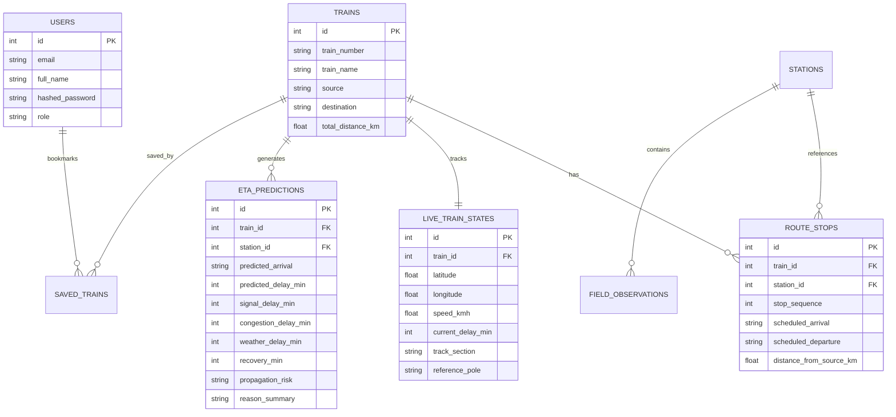

# Rail Nirdeshak — Project Documentation

**Project Name:** Rail Nirdeshak (Dynamic ETA & Delay Propagation Platform for Indian Railways)  
**Event:** Scratch to Hack Hackathon 2026 — Final Round  
**Repository:** `Git-Ignite-Rail-Nirdeshak`  
**Stack:** Python 3.11, FastAPI, SQLite, SQLAlchemy, WebSockets, Leaflet.js, Modern CSS3  

---

## 1. Project Overview & Problem Statement
Indian Railways runs over 13,000 passenger trains daily across saturated, mixed-traffic corridors where express passenger trains, suburban locals, and freight rakes share the same physical tracks.

Existing passenger applications (such as NTES or Where Is My Train) provide only **static delay reporting** (e.g. *"Delayed by 15 mins"* at the last passed station). They fail to model:
1. **Dynamic Delay Evolution:** How a current 15-minute delay evolves over upcoming stations based on train speed, section saturation, and scheduled recovery margins.
2. **Explainability ("Why did the ETA change?"):** Commuters have no visibility into the root causes (signal interlocking, headway congestion, weather, or scheduled padding).
3. **Delay Propagation:** Upstream delays on shared tracks create downstream headway ripple effects on following trains.

**Rail Nirdeshak** solves this by delivering an end-to-end dynamic ETA prediction platform that forecasts evolving arrival times for upcoming 3–5 stations with mathematical explainability, shared-track propagation risk detection, and physical railway survey integration.

---

## 2. Proposed Solution & Objectives

### Core Objectives
- **Dynamic Arrival Estimation:** Predict evolving delay for 3–5 upcoming stations rather than showing static values.
- **Explainable Delay Breakdown:** Break down delay into quantified contributors:
  $$\text{ETA} = \text{Scheduled Time} + \text{Signal Delay} + \text{Congestion Delay} + \text{Weather Delay} - \text{Recovery Buffer}$$
- **Shared-Track Delay Propagation:** Detect upstream headway congestion and flag downstream trains on the same corridor.
- **Track-Aware Positioning:** Augment GPS data with physical railway survey markers (e.g., *KM 68/14*).
- **Dual Working Interfaces:** Passenger Tracking view and Division Traffic Control Room.

---

## 3. System Architecture & Workflow

```mermaid
flowchart TD
    A[Live / Simulated Telemetry] -->|POST /api/telemetry| B[FastAPI Backend Core]
    C[Field Survey Observations] -->|POST /api/field-observations| B
    B --> D[(SQLite Database)]
    B --> E[Dynamic ETA Prediction Engine]
    E --> F[Delay Propagation Evaluator]
    F --> G[Explainable Reason Generator]
    G --> H[WebSocket Broadcast Manager]
    H -->|/ws/trains/{id}| I[Passenger Interface]
    H -->|/ws/control-room| J[Division Control Room]
```

---

## 4. Dynamic ETA Engine & Prediction Logic

The prediction engine in `backend/eta_engine.py` operates on a deterministic, physics-aware mathematical model:

1. **Base Running Time Calculation:**
   Determined from scheduled inter-station running times and current train speed deficit:
   $$\Delta_{\text{speed}} = \max(0, V_{\text{max}} - V_{\text{current}})$$
2. **Signal & Interlocking Delay ($D_{\text{signal}}$):**
   Derived from active automated block signalling observations and on-ground track renewal works.
3. **Section Congestion Delay ($D_{\text{cong}}$):**
   Computed based on section density, speed deficit, and headway proximity to preceding rakes.
4. **Weather Impact ($D_{\text{weather}}$):**
   Calculates visibility constraints (e.g., Dense Fog = $+4\text{ min}$, Rain = $+2\text{ min}$).
5. **Scheduled Recovery Margin ($R_{\text{buffer}}$):**
   Indian Railways schedules include operational time buffers between major junctions. The engine applies dynamic recovery over distance:
   $$R_{\text{buffer}} = \min(D_{\text{cumulative}}, 1.5 \times \text{station\_index})$$
6. **Final Predicted Arrival:**
   $$\text{Predicted Arrival} = T_{\text{scheduled}} + \sum (D_{\text{signal}} + D_{\text{cong}} + D_{\text{weather}} - R_{\text{buffer}})$$

---

## 5. Shared-Track Headway Propagation Logic

When two trains occupy the same corridor section (e.g. *Shane Punjab Express 12497* and *Kalka Shatabdi Express 12011* on `NDLS-PNP-LINE1`):
- If the leading train suffers delay $> 10\text{ min}$, the system flags a **HIGH** propagation risk.
- The trailing train's ETA engine automatically incorporates headway separation delay into upcoming station predictions and triggers a real-time warning banner on both passenger and control room screens.

---

## 6. Database Schema & Models



---

## 7. Key REST & WebSocket APIs

| Endpoint | Method | Description |
|---|---|---|
| `/auth/register` | `POST` | Register passenger or controller account |
| `/auth/login` | `POST` | Sign in & receive JWT bearer token |
| `/auth/me` | `GET` | Retrieve authenticated user profile |
| `/api/trains` | `GET` | Search and filter active corridor trains |
| `/api/trains/{id}` | `GET` | Train route stops, live state, and dynamic ETAs |
| `/api/telemetry` | `POST` | Ingest live telemetry & recalculate ETAs |
| `/api/telemetry/simulate-step/{id}` | `POST` | Step delay/speed for demonstration testing |
| `/api/saved-trains` | `GET` | Retrieve user's bookmarked watchlist |
| `/api/field-observations` | `POST` | Log on-ground survey track observation |
| `/api/control-room/overview` | `GET` | Corridor-wide congestion & headway summary |
| `/ws/trains/{train_id}` | `WS` | Real-time telemetry broadcast to connected clients |

---

## 8. Verification & Test Results

A 12-stage automated test suite (`backend/test_backend.py`) verifies all functional requirements:
1. **Health Check & Startup:** Verified HTTP 200 OK.
2. **User Authentication:** Registered & verified JWT token creation with SHA-256 password hashing.
3. **Corridor Train Details:** Verified Train 12497 (*Shane Punjab Express*) route progression across 9 Northern Railway stations.
4. **Dynamic ETA Calculations:** Verified 5 upcoming stations with scheduled vs predicted time and delay contributor breakdown.
5. **Real-time Recalculation:** Telemetry ingestion successfully updated speed, coordinates, and delay.
6. **Control Room Overview:** Verified live aggregated KPIs and propagation alert detection.
7. **Frontend Delivery:** Verified single-origin root delivery of responsive web client.
8. **Watchlist Operations:** Verified adding and deleting saved trains.

---

## 9. Scalability & Future Scope
- **GPS Telemetry Ingestion at Scale:** Scalable via Kafka / Redis Streams worker consumers.
- **Section Block Simulation Integration:** Direct telemetry feed from Indian Railways National Train Enquiry System (NTES) and Centre for Railway Information Systems (CRIS) APIs.
- **IoT Trackside Sensor Gateway:** Automatic ingestion from trackside RFID tags and axle counter sensors.
